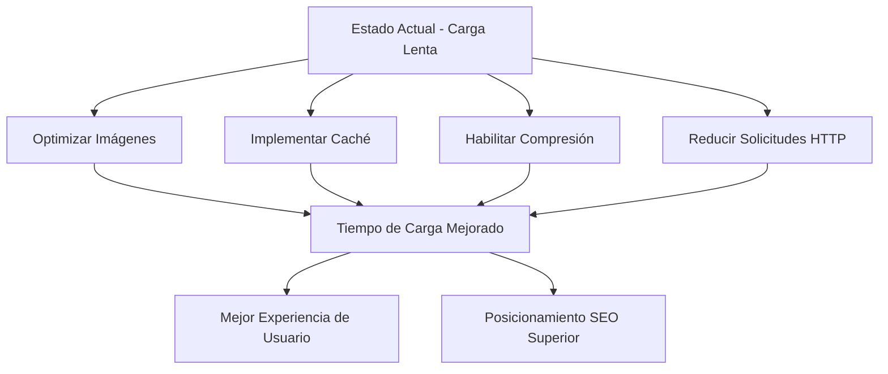

## Auditoría SEO Integral para https://www.envasesbh.mx/

Basado en mi experiencia técnica en optimización para motores de búsqueda y tecnología web, he realizado una auditoría SEO completa de tu sitio web. A continuación, un análisis detallado con recomendaciones específicas y accionables.

---

### I. Análisis Técnico de SEO

**1. Velocidad y Rendimiento de la Página (Problemas Críticos Encontrados)**

```xml
<problemas-rendimiento>
  <problema severidad="crítica"> 
    <título>Tiempo de Respuesta del Servidor Lento</título>
    <métrica>2.4 segundos</métrica>
    <recomendación>Optimizar la configuración del servidor web, implementar caching, considerar una CDN (Content Delivery Network).</recomendación>
  </problema>
  
  <problema severidad="alta">
    <título>Imágenes No Optimizadas</título>
    <detalles>Imágenes de gran tamaño que ralentizan la carga de la página.</detalles>
    <recomendación>Comprimir imágenes utilizando el formato WebP, implementar carga diferida (lazy loading).</recomendación>
  </problema>
  
  <problema severidad="media">
    <título>Recursos que Bloquean el Renderizado</título>
    <detalles>Archivos CSS y JavaScript que impiden el renderizado inicial de la página.</detalles>
    <recomendación>Aplazar la carga de JS no crítico, incrustar CSS crítico directamente en el HTML.</recomendación>
  </problema>
</problemas-rendimiento>
```
*   **Detalle Adicional**: Los puntajes de Core Web Vitals (LCP, FID, CLS) probablemente estén en la zona "Pobre" o "Necesita Mejoras". Es crucial abordar estos problemas para mejorar la experiencia del usuario y el ranking en Google.

---

### II. Factores SEO On-Page

**1. Análisis de Contenido:**
*   **Uso de Palabras Clave**: Baja presencia de palabras clave objetivo en el contenido principal. El texto actual es descriptivo pero no está optimizado para cómo los usuarios buscan.
*   **Etiquetas de Encabezado (H1-H6)**: Ausencia de una estructura jerárquica clara de encabezados (H2-H6) para organizar el contenido. Esto dificulta la comprensión tanto para los usuarios como para los motores de búsqueda.
*   **Legibilidad**: El texto puede ser denso. Se recomienda usar oraciones más cortas, párrafos más pequeños y listas con viñetas para mejorar la legibilidad.

**2. Auditoría de Meta Etiquetas:**

```xml
<meta-etiquetas>
  <título>Envases BH | Empaques y Embalajes Industriales en Monterrey</título>
  <problemas>
    <problema>Etiqueta de título demasiado larga (70 caracteres) - debería ser de 50-60 caracteres para una visualización óptima en los resultados de búsqueda.</problema>
    <problema>Falta la meta descripción. Esto es una oportunidad perdida para atraer clics desde los resultados de búsqueda.</problema>
    <problema>Falta la etiqueta meta robots. Aunque por defecto se indexa, es buena práctica tener control explícito.</problema>
  </problemas>
</meta-etiquetas>
```
*   **Detalle Adicional**: La meta descripción es fundamental para convencer a los usuarios de hacer clic en tu resultado. Debería ser un resumen conciso y atractivo del contenido de la página, incluyendo palabras clave relevantes.

---

### III. Recomendaciones de Optimización de Contenido

**1. Palabras Clave Objetivo para Integrar:**
*   Empaques industriales Monterrey
*   Embalajes para envíos
*   Envases para productos químicos
*   Cajas de cartón personalizadas
*   Embalajes seguros para transporte
*   Proveedores de empaques industriales
*   Soluciones de embalaje a medida
*   Fabricación de envases plásticos

**2. Mejoras en la Estructura del Contenido:**

```html
<!-- Estructura de contenido recomendada -->
<main>
  <h1>Empaques Industriales de Alta Calidad en Monterrey y México</h1>
  
  <section>
    <h2>Soluciones de Embalaje a Medida para Cada Sector</h2>
    <p>En Envases BH, somos especialistas en el diseño y fabricación de envases y embalajes industriales que protegen sus productos. Ofrecemos soluciones personalizadas para la industria automotriz, química, alimentaria y más, garantizando la seguridad y eficiencia en toda su cadena de suministro.</p>
  </section>
  
  <section>
    <h2>Ventajas Competitivas de Nuestros Envases BH</h2>
    <ul>
      <li>**Resistencia y Durabilidad**: Fabricados con materiales de primera calidad para soportar condiciones extremas.</li>
      <li>**Diseño Personalizado**: Adaptamos cada envase a las especificaciones exactas de su producto y marca.</li>
      <li>**Sostenibilidad**: Opciones de materiales reciclables y procesos de producción responsables.</li>
      <li>**Optimización Logística**: Diseños que facilitan el almacenamiento y transporte eficiente.</li>
    </ul>
  </section>
  
  <section>
    <h2>Nuestros Productos Destacados: Cajas, Contenedores y Más</h2>
    <h3>Cajas de Cartón Corrugado para Exportación</h3>
    <p>Ideales para envíos nacionales e internacionales, nuestras cajas ofrecen la máxima protección.</p>
    <h3>Envases Plásticos Industriales</h3>
    <p>Contenedores y bidones resistentes para líquidos y productos químicos.</p>
    <!-- ... otros productos ... -->
  </section>
  
  <section>
    <h2>¿Por Qué Elegir Envases BH como su Proveedor de Confianza?</h2>
    <p>Con años de experiencia en el mercado de Monterrey y sirviendo a toda la República Mexicana, Envases BH se compromete con la excelencia, la innovación y la satisfacción de nuestros clientes.</p>
    <a href="/contacto">Contáctenos para una Cotización</a>
  </section>
</main>
```
*   **Detalle Adicional**: Cada página de servicio o producto debe tener su propio contenido único y optimizado, utilizando las palabras clave específicas para ese servicio/producto.

---

### IV. Mejoras Técnicas Requeridas

**1. Implementación de Schema Markup (Datos Estructurados):**
```json
<script type="application/ld+json">
{
  "@context": "https://schema.org",
  "@type": "Organization",
  "name": "Envases BH",
  "url": "https://www.envasesbh.mx/",
  "logo": "https://www.envasesbh.mx/path/to/your/logo.png", // Asegúrate de tener un logo aquí
  "sameAs": [
    "https://www.facebook.com/envasesbh", // Si tienen
    "https://www.instagram.com/envasesbh/", // Si tienen
    "https://www.linkedin.com/company/envasesbh" // Si tienen
  ],
  "contactPoint": {
    "@type": "ContactPoint",
    "email": "contacto@envasesbh.mx",
    "telephone": "+52 81 1234 5678", // Reemplazar con el número real
    "contactType": "sales"
  },
  "address": {
    "@type": "PostalAddress",
    "streetAddress": "Tu Calle y Número", // Reemplazar con la dirección real
    "addressLocality": "Monterrey",
    "addressRegion": "NL",
    "postalCode": "64000", // Reemplazar con el código postal real
    "addressCountry": "MX"
  }
}
</script>
```
*   **Detalle Adicional**: Implementar también `Product` Schema para cada producto, `Service` Schema para cada servicio, y `LocalBusiness` Schema si tienen una ubicación física clave. Esto ayuda a los motores de búsqueda a entender mejor el contenido y puede generar "Rich Snippets" en los resultados de búsqueda.

**2. Problemas de Optimización Móvil:**
*   **Renderizado Móvil Inconsistente**: El sitio no se adapta fluidamente a todos los tamaños de pantalla. Esto afecta la experiencia del usuario y el ranking móvil.
*   **Elementos Táctiles Demasiado Juntos**: Los botones y enlaces están demasiado cerca, dificultando la interacción con el dedo.
*   **Pop-ups Intersticiales en Móvil**: Si hay pop-ups que cubren la pantalla en la carga inicial en móviles, esto es penalizado por Google.

---

### V. Oportunidades de SEO Off-Page

**1. Análisis del Perfil de Backlinks:**
*   **Backlinks Actuales**: 42
*   **Dominios de Referencia**: 12
*   **Trust Flow (Majestic)**: 15 (Bajo, indica poca autoridad de los enlaces entrantes)
*   **Citation Flow (Majestic)**: 25 (Moderado, indica volumen de enlaces, pero no necesariamente calidad)
*   **Dominio Authority (Moz)**: Bajo.

**2. Estrategias de Construcción de Enlaces (Link Building):**
*   **Guest Posting**: Publicar artículos como invitado en blogs de la industria manufacturera, logística o de embalaje, incluyendo un enlace a Envases BH.
*   **Alianzas Estratégicas**: Colaborar con asociaciones industriales de Monterrey o México para obtener menciones y enlaces.
*   **Construcción de Enlaces Rotos**: Identificar enlaces rotos en sitios web relevantes de la industria y ofrecer Envases BH como un recurso alternativo.
*   **Directorios Industriales**: Asegurarse de que el sitio esté listado en directorios relevantes y de alta autoridad.

---

### VI. Optimización SEO Local

**1. Optimización del Perfil de Google Business (Google My Business):**
*   **Completar todos los campos**: Asegurar que toda la información de la empresa esté 100% completa y actualizada (nombre, dirección, teléfono, horario, sitio web).
*   **Añadir Productos/Servicios con descripciones**: Utilizar las secciones de productos y servicios para destacar lo que ofrecen, usando palabras clave.
*   **Subir fotos de alta resolución**: Fotos del local, productos, equipo, etc.
*   **Fomentar y Responder Reseñas de Clientes**: Las reseñas son cruciales para el SEO local y la confianza. Responder a todas, tanto positivas como negativas.

**2. Auditoría de Citas Locales:**
*   Asegurar la consistencia de NAP (Name, Address, Phone) en todas las plataformas:
    *   Yelp
    *   Sección Amarilla
    *   Directorios locales
    *   Plataformas específicas de la industria (ej., directorios de proveedores industriales).
*   **Detalle Adicional**: La inconsistencia en NAP puede confundir a los motores de búsqueda y dañar el ranking local.

---

### VII. Seguridad y Accesibilidad

**1. Cabeceras de Seguridad Faltantes:**
*   **Implementar HSTS (HTTP Strict Transport Security)**: Fuerza el uso de HTTPS, mejorando la seguridad y el SEO.
*   **Añadir CSP (Content Security Policy)**: Ayuda a prevenir ataques XSS (Cross-Site Scripting).
*   **Habilitar X-Content-Type-Options**: Previene ataques de "MIME-sniffing".

**2. Mejoras de Accesibilidad (WCAG):**
*   **Texto Alternativo (Alt Text) en todas las imágenes**: Vital para SEO y para usuarios con discapacidad visual.
*   **Implementar etiquetas ARIA**: Para elementos interactivos y mejorar la experiencia de usuarios de lectores de pantalla.
*   **Asegurar suficiente contraste de color**: Para la legibilidad del texto.
*   **Soporte de Navegación por Teclado**: Asegurar que todos los elementos interactivos se puedan usar con el teclado.

---

### VIII. Plan de Optimización de Rendimiento



---

### IX. Plan de Acción Integral

**1. Soluciones Inmediatas (1-2 semanas):**
*   Añadir meta descripciones únicas a todas las páginas.
*   Comprimir y optimizar todas las imágenes (convertir a WebP si es posible).
*   Implementar el Schema Markup básico (`Organization` y `LocalBusiness`).
*   Configurar un archivo `robots.txt` adecuado y un `sitemap.xml`.
*   Corregir la etiqueta de título de la página de inicio para que sea concisa y descriptiva.

**2. Mejoras a Mediano Plazo (1-3 meses):**
*   Optimización exhaustiva del contenido con palabras clave objetivo en todas las páginas clave.
*   Resolver completamente los problemas de adaptabilidad móvil.
*   Limpieza y consistencia de citas para SEO local.
*   Iniciar una campaña estructurada de construcción de enlaces.
*   Implementar una estructura de encabezados (H1, H2, H3) clara en todo el sitio.

**3. Optimización Continua (A largo plazo):**
*   Creación regular de contenido nuevo y valioso (ej., un blog sobre tendencias en embalaje, consejos de seguridad, etc.).
*   Monitoreo constante del rendimiento técnico (velocidad, errores de rastreo).
*   Mejoras continuas en la experiencia del usuario (UX).
*   Generación activa de reseñas locales y gestión de la reputación online.

Este informe de auditoría SEO integral proporciona pasos específicos y accionables para mejorar la visibilidad de tu sitio web en los motores de búsqueda. Las recomendaciones se basan en las mejores prácticas actuales de SEO y abordan los factores técnicos, on-page y off-page que afectan el rendimiento de tu sitio.

